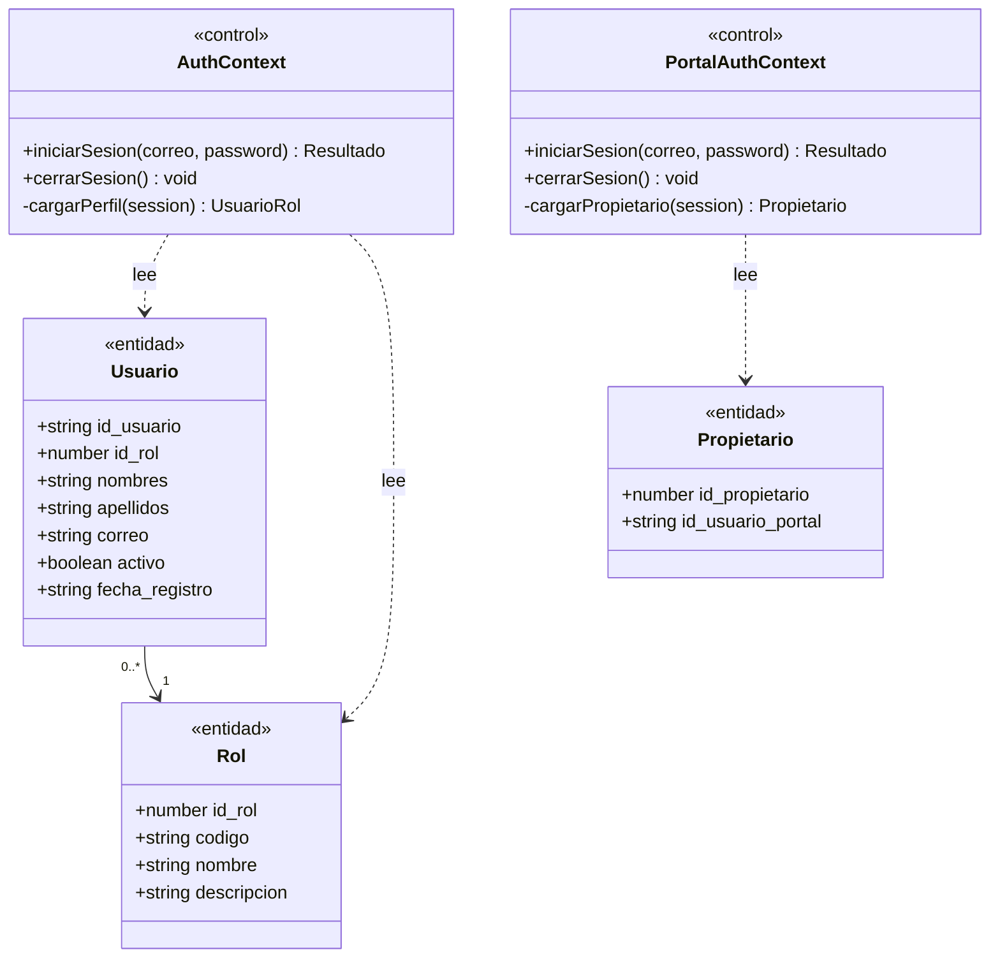
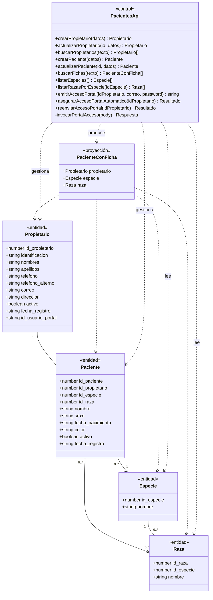
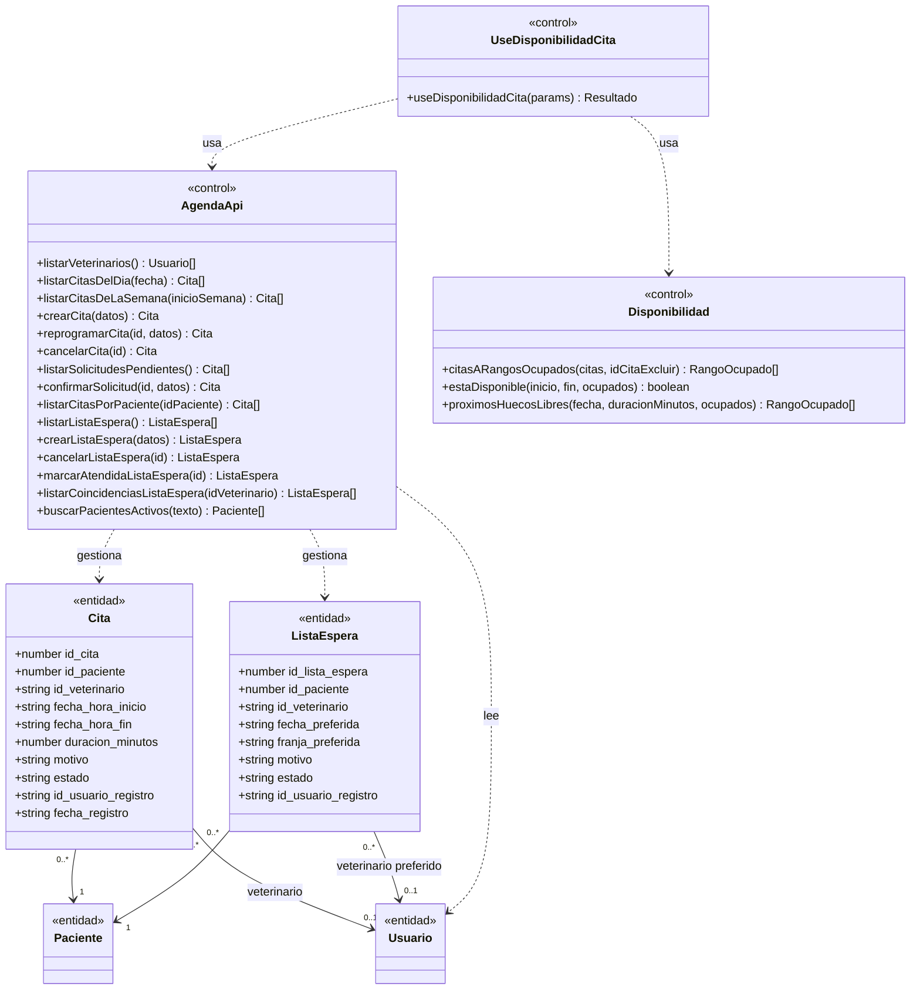
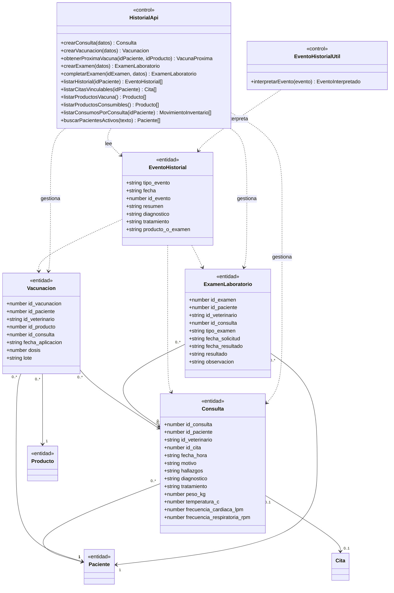
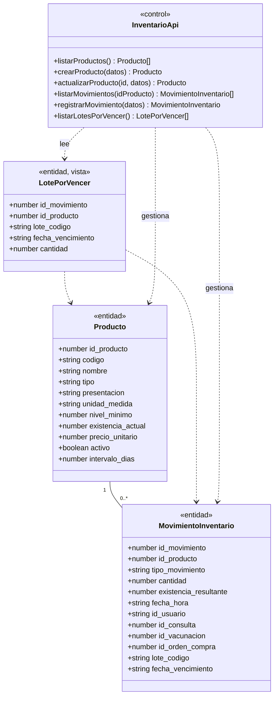
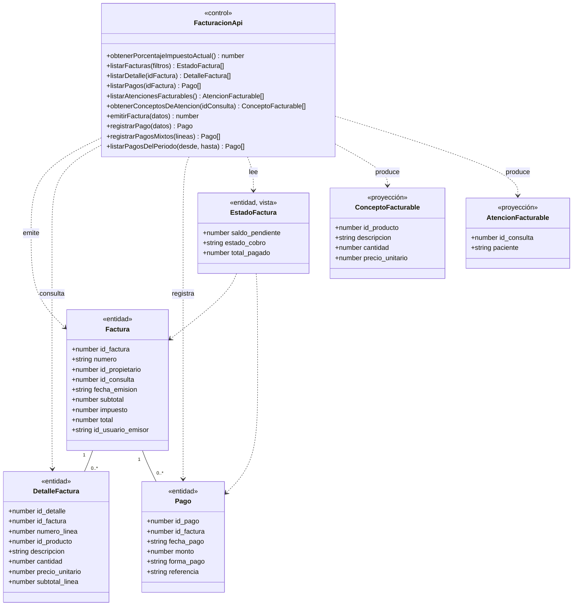
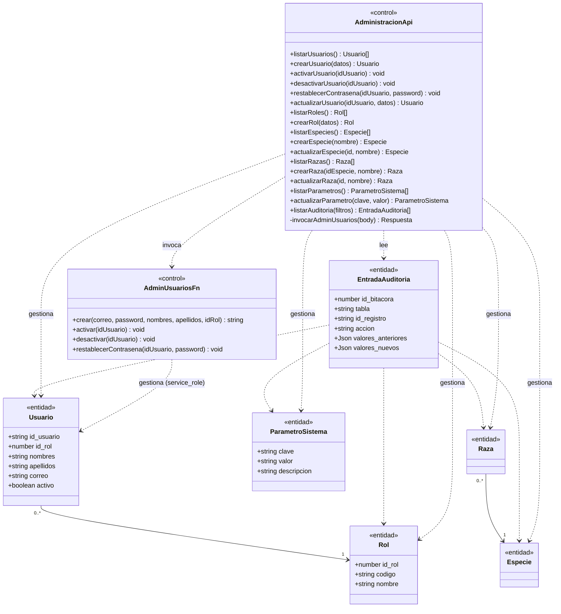
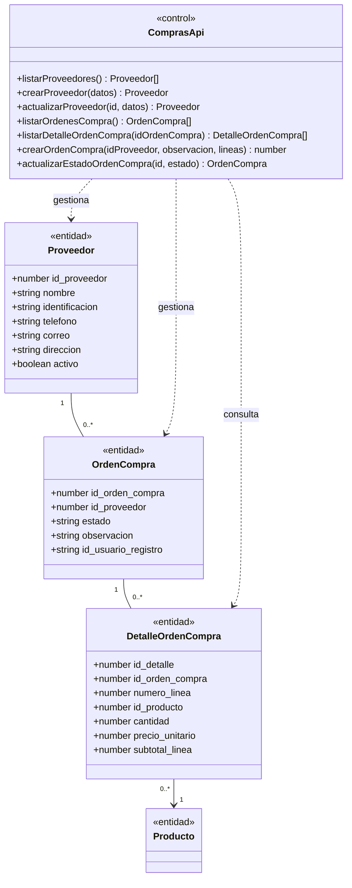
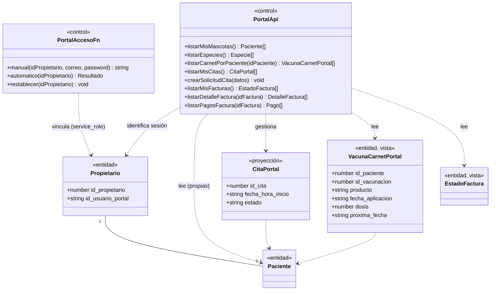

# Guía para Diagramas de Clases UML — VetCare

## 1. Alcance y criterio de modelado

VetCare no está escrito con clases orientadas a objetos: el frontend
(`frontend/src`) es una SPA de React con componentes funcionales y funciones
sueltas; el "backend" es PostgreSQL (tablas, vistas, funciones `plpgsql`/`sql`,
triggers) más dos funciones Edge en Deno. Aun así, el código separa con
claridad tres responsabilidades distintas y consistentes en todo el proyecto,
que corresponden exactamente al patrón **Entidad — Control — Frontera**
(Entity-Control-Boundary), un estilo de modelado UML estándar para sistemas con
un modelo de datos "anémico" (sin comportamiento propio) y una capa de
servicio separada — que es exactamente la forma de VetCare:

- **Clases de entidad (`«entidad»`):** las interfaces de
  `frontend/src/types/dominio.ts` y de los `api.ts` de cada módulo. Cada una
  corresponde 1:1 a una tabla o vista real de PostgreSQL (documentadas en el
  Documento 5), o es una proyección de una de ellas. Solo tienen atributos: el
  dato en sí. Sección 3.
- **Clases de control (`«control»`):** cada archivo `api.ts` (uno por carpeta
  de `frontend/src/modules/*` y uno en `frontend/src/portal/`), cada contexto
  de sesión (`AuthContext`, `PortalAuthContext`), el hook de disponibilidad de
  Agenda y las dos funciones Edge. Sus métodos son las funciones que
  realmente exportan o declaran; son las clases que reciben los mensajes que
  después aparecen en los diagramas de secuencia (Documento 3). Sección 4.
- **Clases de frontera (`«frontera»`):** los componentes de React con los que
  interactúa un actor — páginas y diálogos. Sus métodos son las funciones
  internas con las que el propio componente responde a la interacción del
  usuario (`guardar`, `validar`, `cancelar`, `emitir`, etc.), verificables en
  el código de cada archivo. Sección 5.

Esta división no es una capa arquitectónica que el proyecto declare
explícitamente con esos nombres, pero sí es la que su código sigue de forma
consistente en las nueve carpetas de `modules/` y en `portal/`: un componente
de frontera nunca llama directamente a `@supabase/supabase-js`, siempre pasa
por la función de control correspondiente de su propio `api.ts`. Modelar así
es lo que permite que cada mensaje de los diagramas de secuencia (Documento 3)
corresponda a un método real, declarado en una clase real de este documento —
el objetivo de coherencia que exige la relación entre ambos diagramas.

Las funciones de PostgreSQL (`fn_emitir_factura`, `fn_actualizar_existencia`,
etc.), los triggers y las vistas no se modelan como una clase adicional con
compartimento de métodos: son las operaciones internas del nodo de
persistencia ("Postgres"), documentadas por completo en el Documento 5, y se
citan como mensajes hacia ese nodo en el Documento 3, igual que se cita una
llamada a un procedimiento almacenado en cualquier sistema con lógica en la
base de datos.

## 2. Notación usada en este documento

```text
Clase «estereotipo»
- Propósito
- Atributos relevantes            (solo entidad)
- Métodos relevantes               (control y frontera; firma completa)
- Relaciones
- Multiplicidades
- Módulo
```

Visibilidad: `+` público (todo lo exportado: toda función de un `api.ts`, todo
componente exportado, todo atributo de una interfaz — no hay clases con
encapsulamiento en este código, así que no hay atributos privados). `-`
privado, reservado para las pocas funciones declaradas pero **no exportadas**
de un módulo (por ejemplo, `invocarPortalAcceso` en `pacientes/api.ts`, que
solo usan otras funciones del mismo archivo).

## 3. Clases de entidad (`«entidad»`)

### 3.1. Módulo 1 — Pacientes y Propietarios

#### Propietario
- **Propósito:** dueño de una o más mascotas; no es un usuario del sistema
  (no inicia sesión como personal), salvo que además tenga una cuenta de
  portal (Módulo 8).
- **Atributos:** `+id_propietario: number`, `+identificacion: string`,
  `+nombres: string`, `+apellidos: string`, `+telefono: string`,
  `+telefono_alterno: string | null`, `+correo: string | null`,
  `+direccion: string | null`, `+activo: boolean`,
  `+fecha_registro: string`, `+id_usuario_portal: string | null` (UUID de
  `auth.users`; lo escribe únicamente la función Edge `portal-acceso`, nunca
  un formulario).
- **Relaciones:** asociación 1 a muchos con `Paciente` (`id_propietario`);
  asociación 1 a muchos con `Factura` (`id_propietario`); asociación opcional
  1 a 1 con la identidad de portal (`id_usuario_portal`, Módulo 8).
- **Multiplicidad:** `Propietario` "1" — "0..*" `Paciente`.
- **Módulo:** 1; el atributo `id_usuario_portal` pertenece a la ampliación
  del Módulo 8.
- **Manipulada por:** `pacientes/api.ts` (control, sección 4.1).

#### Paciente
- **Atributos:** `+id_paciente: number`, `+id_propietario: number`,
  `+id_especie: number`, `+id_raza: number | null`, `+nombre: string`,
  `+sexo: 'M' | 'H'`, `+fecha_nacimiento: string | null`,
  `+color: string | null`, `+activo: boolean`, `+fecha_registro: string`.
- **Relaciones:** N a 1 con `Propietario`; N a 1 con `Especie`; N a 1
  opcional con `Raza`, restringida por la clave foránea compuesta
  `(id_raza, id_especie)` — una raza solo puede asociarse si pertenece a la
  especie declarada del paciente (RN-003).
- **Multiplicidad:** `Paciente` "0..*" — "1" `Propietario`; `Paciente`
  "0..*" — "0..1" `Raza`.
- **Módulo:** 1. **Manipulada por:** `pacientes/api.ts`.

#### PacienteConFicha, PacienteParaCita (proyecciones de `Paciente`)
- **PacienteConFicha:** todos los atributos de `Paciente`, más
  `+propietario: Propietario`, `+especie: Especie`, `+raza: Raza | null`.
  Composición de lectura, no persiste aparte. Módulo 1 (también 3 y 8).
- **PacienteParaCita:** `+id_paciente: number`, `+nombre: string`,
  `+sexo: 'M' | 'H'`,
  `+propietario: Pick<Propietario,'nombres'|'apellidos'|'telefono'>`.
  Definida en `agenda/api.ts`. Módulo 2.

#### Especie / Raza
- **Especie:** `+id_especie: number`, `+nombre: string`. 1 a muchos con
  `Raza` y con `Paciente`. Módulo 1 (catálogo); administrable desde el
  Módulo 6.
- **Raza:** `+id_raza: number`, `+id_especie: number`, `+nombre: string`. N
  a 1 con `Especie`. Módulo 1; administrable desde el Módulo 6.

### 3.2. Módulo 2 — Agenda y Citas

#### Cita
- **Atributos:** `+id_cita: number`, `+id_paciente: number`,
  `+id_veterinario: string | null` (nulo únicamente mientras
  `estado='solicitada'`, Módulo 8), `+fecha_hora_inicio: string`,
  `+fecha_hora_fin: string` (calculada siempre por el trigger
  `fn_calcular_fin_cita`), `+duracion_minutos: number`,
  `+motivo: string | null`,
  `+estado: 'solicitada'|'programada'|'cancelada'|'atendida'`,
  `+id_usuario_registro: string | null`, `+fecha_registro: string`.
- **Relaciones:** N a 1 con `Paciente`; N a 1 opcional con `Usuario`
  (veterinario); 1 a 0..1 con `Consulta` (`consulta.id_cita` es `unique`).
- **Restricción de instancia:** dos citas del mismo veterinario con
  `estado in ('programada','atendida')` nunca se solapan (`EXCLUDE`,
  RN-004) — se anota como restricción `{sin solapamiento por veterinario}`
  junto a la clase en el diagrama.
- **Módulo:** 2; `'solicitada'` e `id_veterinario` nulo pertenecen al
  Módulo 8. **Manipulada por:** `agenda/api.ts`, `portal/api.ts`
  (`crearSolicitudCita`).

#### CitaConDetalle, CitaResumen (proyecciones de `Cita`)
- **CitaConDetalle:** todos los de `Cita`, más `+paciente: PacienteParaCita`,
  `+veterinario: Pick<Usuario,'id_usuario'|'nombres'|'apellidos'> | null`.
- **CitaResumen:** `+id_cita: number`, `+fecha_hora_inicio: string`,
  `+motivo: string | null`, `+estado: Cita['estado']`,
  `+veterinario: Pick<Usuario,'nombres'|'apellidos'>`. Consumida por el
  Módulo 1 (pestaña "Citas" de la ficha).

#### ListaEspera / ListaEsperaConPaciente
- **ListaEspera:** `+id_lista_espera: number`, `+id_paciente: number`,
  `+id_veterinario: string | null` (`null`="cualquiera"),
  `+fecha_preferida: string | null`,
  `+franja_preferida: 'manana'|'tarde'|null`, `+motivo: string`,
  `+estado: 'pendiente'|'atendida'|'cancelada'`,
  `+id_usuario_registro: string`, `+fecha_registro: string`.
- **Relaciones:** N a 1 con `Paciente`; N a 1 opcional con `Usuario`.
- **ListaEsperaConPaciente:** todos los de `ListaEspera`, más
  `+paciente: PacienteParaCita`,
  `+veterinario: Pick<Usuario,'id_usuario'|'nombres'|'apellidos'> | null`.
- **Módulo:** 2. **Manipulada por:** `agenda/api.ts`.

### 3.3. Módulo 3 — Historial Clínico

#### Consulta
- **Atributos:** `+id_consulta: number`, `+id_paciente: number`,
  `+id_veterinario: string`, `+id_cita: number | null`,
  `+fecha_hora: string`, `+motivo: string`, `+hallazgos: string | null`,
  `+diagnostico: string`, `+tratamiento: string | null`,
  `+peso_kg: number | null`, `+temperatura_c: number | null`,
  `+frecuencia_cardiaca_lpm: number | null`,
  `+frecuencia_respiratoria_rpm: number | null`.
- **Relaciones:** N a 1 con `Paciente`; N a 1 con `Usuario`; N a 1 opcional
  con `Cita`; 1 a 0..1 con `Factura` (`factura.id_consulta` es `unique`,
  RN-013); 1 a 0..* con `Vacunacion`; 1 a 0..* con `ExamenLaboratorio`; 1 a
  0..* con `MovimientoInventario` (consumos manuales, vía `id_consulta`).
- **Módulo:** 3. **Manipulada por:** `historial/api.ts` (solo
  `crearConsulta`; sin operación de edición ni borrado, RN-007).

#### Vacunacion
- **Atributos:** `+id_vacunacion: number`, `+id_paciente: number`,
  `+id_veterinario: string`, `+id_producto: number`,
  `+id_consulta: number | null`, `+fecha_aplicacion: string`,
  `+dosis: number`, `+lote: string | null`.
- **Relaciones:** N a 1 con `Paciente`, `Usuario`, `Producto`
  (restringido a `tipo='vacuna'` por `fn_validar_producto_vacuna`); N a 1
  opcional con `Consulta`; dependencia hacia `MovimientoInventario` (dispara
  uno de tipo `consumo`, no lo compone).
- **Módulo:** 3. **Manipulada por:** `historial/api.ts`
  (`crearVacunacion`, `obtenerProximaVacuna`).

#### ExamenLaboratorio
- **Atributos:** `+id_examen: number`, `+id_paciente: number`,
  `+id_veterinario: string`, `+id_consulta: number | null`,
  `+tipo_examen: string`, `+fecha_solicitud: string`,
  `+fecha_resultado: string | null`, `+resultado: string | null`,
  `+observacion: string | null`.
- **Relaciones:** N a 1 con `Paciente`, `Usuario`; N a 1 opcional con
  `Consulta`.
- **Módulo:** 3. **Manipulada por:** `historial/api.ts` (`crearExamen`,
  `completarExamen` — esta última, la única operación de actualización
  sobre una entidad clínica, RF-019/RN-007).

#### EventoHistorial (vista de solo lectura)
- **Propósito:** fila de `v_historial_clinico`; unifica `Consulta`,
  `Vacunacion` y `ExamenLaboratorio` en una sola línea de tiempo. La función
  de control `interpretarEvento()` (`historial/eventoHistorial.ts`) es el
  único punto que traduce sus columnas reutilizadas posicionalmente según
  `tipo_evento`.
- **Atributos:** `+id_paciente: number`,
  `+tipo_evento: 'consulta'|'vacunacion'|'examen'`, `+fecha: string`,
  `+id_evento: number`, `+resumen: string`, `+diagnostico: string | null`,
  `+tratamiento: string | null`, `+producto_o_examen: string | null`,
  `+id_veterinario: string`, `+temperatura_c: number | null`,
  `+frecuencia_cardiaca_lpm: number | null`,
  `+frecuencia_respiratoria_rpm: number | null`.
- **Relaciones:** dependencia de lectura sobre `Consulta`, `Vacunacion`,
  `ExamenLaboratorio` (unión, no herencia). **Manipulada por:**
  `historial/api.ts` (`listarHistorial`).

#### VacunaProxima (vista de solo lectura)
- **Atributos:** `+id_paciente: number`, `+id_producto: number`,
  `+producto: string`, `+ultima_aplicacion: string`,
  `+intervalo_dias: number`, `+proxima_fecha: string`. Módulo 3.

### 3.4. Módulo 4 — Inventario y Medicamentos

#### Producto
- **Atributos:** `+id_producto: number`, `+codigo: string`,
  `+nombre: string`, `+tipo: 'medicamento'|'insumo'|'vacuna'`,
  `+presentacion: string | null`, `+unidad_medida: string`,
  `+nivel_minimo: number`,
  `+existencia_actual: number` (mantenida por `fn_actualizar_existencia`),
  `+precio_unitario: number`, `+activo: boolean`,
  `+intervalo_dias: number | null`.
- **Relaciones:** 1 a muchos con `MovimientoInventario`; 1 a muchos con
  `Vacunacion` (si `tipo='vacuna'`); 1 a muchos con `DetalleFactura`; 1 a
  muchos con `DetalleOrdenCompra`.
- **Módulo:** 4. **Manipulada por:** `inventario/api.ts`.

#### MovimientoInventario / MovimientoConResponsable / LotePorVencer
- **MovimientoInventario:** `+id_movimiento: number`, `+id_producto: number`,
  `+tipo_movimiento: 'ingreso'|'ajuste'|'consumo'`, `+cantidad: number`,
  `+existencia_resultante: number` (calculada por trigger),
  `+fecha_hora: string`, `+id_usuario: string`,
  `+id_consulta: number | null`, `+id_vacunacion: number | null`,
  `+observacion: string | null`, `+lote_codigo: string | null`,
  `+fecha_vencimiento: string | null`, `+id_orden_compra: number | null`
  (Módulo 7).
- **Restricción de instancia:** exactamente uno de
  `id_consulta`/`id_vacunacion` presente, solo si `tipo_movimiento='consumo'`
  (RN-009).
- **MovimientoConResponsable:** todos los anteriores, más
  `+usuario: Pick<Usuario,'nombres'|'apellidos'>`.
- **LotePorVencer:** `+id_movimiento: number`, `+id_producto: number`,
  `+producto: string`, `+lote_codigo: string | null`,
  `+fecha_vencimiento: string`, `+cantidad: number`, `+fecha_hora: string`.
- **Módulo:** 4. **Manipulada por:** `inventario/api.ts`
  (`registrarMovimiento`, sin edición ni borrado: bitácora *append-only*,
  RF-027/RNF-010).

### 3.5. Módulo 5 — Facturación y Reportes

#### Factura
- **Atributos:** `+id_factura: number`,
  `+numero: string` (asignada por `fn_asignar_numero_factura`),
  `+id_propietario: number`, `+id_consulta: number | null`,
  `+fecha_emision: string`,
  `+subtotal: number` (mantenido por `trg_totales_factura`),
  `+impuesto: number`, `+total: number` (columna generada),
  `+id_usuario_emisor: string`.
- **Relaciones:** N a 1 con `Propietario`; N a 0..1 con `Consulta`
  (RN-013); 1 a muchos con `DetalleFactura`; 1 a muchos con `Pago`.
- **Módulo:** 5. **Manipulada por:** `facturacion/api.ts`
  (`emitirFactura`, sin `UPDATE`/`DELETE` de aplicación).

#### DetalleFactura
- **Atributos:** `+id_detalle: number`, `+id_factura: number`,
  `+numero_linea: number`, `+id_producto: number | null`,
  `+descripcion: string`, `+cantidad: number`,
  `+precio_unitario: number` (resuelto por `fn_emitir_factura` en el
  momento de emitir, RN-014), `+subtotal_linea: number` (generada).
- **Relaciones:** N a 1 con `Factura` (composición); N a 1 opcional con
  `Producto`. Inmutable: sin operaciones de edición. Módulo 5.

#### Pago
- **Atributos:** `+id_pago: number`, `+id_factura: number`,
  `+fecha_pago: string`, `+monto: number`,
  `+forma_pago: 'efectivo'|'tarjeta'|'transferencia'`,
  `+referencia: string | null`, `+id_usuario: string`.
- **Relaciones:** N a 1 con `Factura`, `Usuario`. **Manipulada por:**
  `facturacion/api.ts` (`registrarPago`, `registrarPagosMixtos`).

#### EstadoFactura / FacturaListada / ConceptoFacturable / AtencionFacturable
- **EstadoFactura:** fila de `v_estado_factura`: `+id_factura: number`,
  `+numero: string`, `+id_propietario: number`,
  `+id_consulta: number | null`, `+fecha_emision: string`,
  `+id_usuario_emisor: string`, `+subtotal: number`, `+impuesto: number`,
  `+total: number`, `+total_pagado: number`, `+saldo_pendiente: number`,
  `+estado_cobro: 'pendiente'|'parcial'|'pagada'` (derivados, RN-015).
- **FacturaListada:** todos los de `EstadoFactura`, más
  `+propietario: Pick<Propietario,'identificacion'|'nombres'|'apellidos'>`.
- **ConceptoFacturable:** `+id_producto: number | null`,
  `+descripcion: string`, `+cantidad: number`, `+precio_unitario: number`
  (parámetro/retorno, no una tabla).
- **AtencionFacturable:** `+id_consulta: number`, `+fecha_hora: string`,
  `+id_propietario: number`, `+paciente: string`,
  `+propietario_nombres: string`, `+propietario_apellidos: string`,
  `+propietario_identificacion: string` (sin datos clínicos, RN-006).
- **Módulo:** 5. **Manipuladas por:** `facturacion/api.ts`.

### 3.6. Módulo 6 — Administración del sistema

#### Rol / Usuario / UsuarioConRol
- **Rol:** `+id_rol: number`, `+codigo: RolCodigo`, `+nombre: string`,
  `+descripcion: string | null`. 1 a muchos con `Usuario`.
- **Usuario:** `+id_usuario: string` (UUID, FK a `auth.users`),
  `+id_rol: number`, `+nombres: string`, `+apellidos: string`,
  `+correo: string`, `+activo: boolean`, `+fecha_registro: string`.
  Relaciones: N a 1 con `Rol`; 1 a muchos con `Cita` (veterinario),
  `Consulta`, `Vacunacion`, `ExamenLaboratorio`, `MovimientoInventario`,
  `Factura`, `Pago`, `OrdenCompra`, `ListaEspera` (autor/responsable).
- **UsuarioConRol:** todos los de `Usuario`, más `+rol: Rol`.
- **Módulo:** 1 (creación original fuera de la aplicación) y 6 (ciclo de
  vida completo). **Manipuladas por:** `administracion/api.ts`, función
  Edge `admin-usuarios`.

#### ParametroSistema / EntradaAuditoria / EntradaAuditoriaConUsuario
- **ParametroSistema:** `+clave: string` (clave primaria), `+valor: string`,
  `+descripcion: string | null`, `+fecha_actualizacion: string`,
  `+id_usuario_actualizo: string | null`.
- **EntradaAuditoria:** `+id_bitacora: number`, `+tabla: string`,
  `+id_registro: string | null`, `+accion: 'insert'|'update'`,
  `+valores_anteriores: Record<string,unknown> | null`,
  `+valores_nuevos: Record<string,unknown>`, `+id_usuario: string | null`,
  `+fecha_hora: string`. Dependencia de escritura desde `Usuario`, `Rol`,
  `Especie`, `Raza`, `ParametroSistema` (trigger genérico
  `fn_auditar_cambio`).
- **EntradaAuditoriaConUsuario:** todos los de `EntradaAuditoria`, más
  `+usuario: Pick<Usuario,'nombres'|'apellidos'> | null`.
- **Módulo:** 6. **Manipuladas por:** `administracion/api.ts`.

### 3.7. Módulo 7 — Compras y Proveedores

#### Proveedor
- **Atributos:** `+id_proveedor: number`, `+nombre: string`,
  `+identificacion: string`, `+telefono: string`, `+correo: string | null`,
  `+direccion: string | null`, `+activo: boolean`,
  `+fecha_registro: string`. 1 a muchos con `OrdenCompra`. **Manipulado
  por:** `compras/api.ts`.

#### OrdenCompra / DetalleOrdenCompra / LineaOrdenCompra
- **OrdenCompra:** `+id_orden_compra: number`, `+id_proveedor: number`,
  `+estado: 'borrador'|'emitida'|'recibida'|'cancelada'`,
  `+observacion: string | null`, `+id_usuario_registro: string`,
  `+fecha_registro: string`. N a 1 con `Proveedor`; 1 a muchos con
  `DetalleOrdenCompra`; 1 a muchos con `MovimientoInventario` (generados al
  recibirse).
- **DetalleOrdenCompra:** `+id_detalle: number`, `+id_orden_compra: number`,
  `+numero_linea: number`, `+id_producto: number`, `+cantidad: number`,
  `+precio_unitario: number`, `+subtotal_linea: number` (generada). N a 1
  con `OrdenCompra` (composición); N a 1 con `Producto`. Inmutable.
- **LineaOrdenCompra:** `+id_producto: number`, `+cantidad: number`,
  `+precio_unitario: number` (parámetro de `fn_crear_orden_compra`, no una
  tabla).
- **Módulo:** 7. **Manipuladas por:** `compras/api.ts`.

### 3.8. Módulo 8 — Portal del propietario

Reutiliza `Propietario`, `PacienteConFicha`, `EstadoFactura`,
`DetalleFactura`, `Pago` ya definidos. Agrega:

#### VacunaCarnetPortal (vista de solo lectura)
- **Atributos:** `+id_paciente: number`, `+id_vacunacion: number`,
  `+producto: string`, `+fecha_aplicacion: string`, `+dosis: number`,
  `+proxima_fecha: string | null`. Sin diagnóstico/hallazgos/tratamiento
  (RN-006 también en el portal). **Manipulada por:** `portal/api.ts`
  (`listarCarnetPorPaciente`).

#### CitaPortal (proyección local de `Cita`)
- **Atributos:** `+id_cita: number`, `+id_paciente: number`,
  `+fecha_hora_inicio: string`, `+duracion_minutos: number`,
  `+motivo: string | null`, `+estado: string`,
  `+paciente: { nombre: string }`,
  `+veterinario: { nombres: string; apellidos: string } | null`.
  **Manipulada por:** `portal/api.ts` (`listarMisCitas`).

## 4. Clases de control (`«control»`)

Cada clase de esta sección corresponde a un archivo real; sus métodos son
exactamente sus funciones exportadas (visibilidad `+`) o privadas del módulo
(visibilidad `-`). Los parámetros usan los tipos declarados en el propio
código; se omiten aquí los tipos de retorno ya evidentes por el nombre del
método para no duplicar la firma completa de cada uno (están en el código
fuente citado).

### 4.1. `pacientes/api.ts`
- **Módulo:** 1.
- **Métodos:**
  `-invocarPortalAcceso(body: Record<string,unknown>)`,
  `+emitirAccesoPortal(idPropietario: number, correo: string, password: string)`,
  `+asegurarAccesoPortalAutomatico(idPropietario: number)`,
  `+reenviarAccesoPortal(idPropietario: number)`,
  `+listarEspecies()`, `+listarRazasPorEspecie(idEspecie: number)`,
  `+buscarPropietarios(texto: string)`, `+buscarFichas(texto: string)`,
  `+crearPropietario(datos)`, `+actualizarPropietario(id: number, datos)`,
  `+crearPaciente(datos)`, `+actualizarPaciente(id: number, datos)`.
- **Depende de (entidades):** `Propietario`, `Paciente`, `PacienteConFicha`,
  `Especie`, `Raza`. **Invoca:** PostgREST (`propietario`, `paciente`,
  `especie`, `raza`) y la función Edge `portal-acceso`.

### 4.2. `agenda/api.ts`
- **Módulo:** 2.
- **Métodos:** `+listarVeterinarios()`, `+listarCitasDelDia(fecha: string)`,
  `+listarCitasDeLaSemana(inicioSemana: Dayjs)`,
  `+buscarPacientesActivos(texto: string)`, `+crearCita(datos)`,
  `+reprogramarCita(id: number, datos)`,
  `+listarSolicitudesPendientes()`,
  `+confirmarSolicitud(id: number, datos)`,
  `+listarCitasPorPaciente(idPaciente: number)`, `+cancelarCita(id: number)`,
  `+listarListaEspera()`, `+crearListaEspera(datos)`,
  `+cancelarListaEspera(id: number)`, `+marcarAtendidaListaEspera(id: number)`,
  `+listarCoincidenciasListaEspera(idVeterinario: string)`.
- **Depende de:** `Cita`, `CitaConDetalle`, `CitaResumen`, `ListaEspera`,
  `ListaEsperaConPaciente`, `PacienteParaCita`, `Usuario`, `Rol`.

### 4.3. `historial/api.ts`
- **Módulo:** 3.
- **Métodos:** `+buscarPacientesActivos(texto: string)`,
  `+listarHistorial(idPaciente: number)`,
  `+listarCitasVinculables(idPaciente: number)`,
  `+listarProductosVacuna()`, `+crearConsulta(datos)`,
  `+crearVacunacion(datos)`,
  `+obtenerProximaVacuna(idPaciente: number, idProducto: number)`,
  `+crearExamen(datos)`,
  `+completarExamen(idExamen: number, datos)`,
  `+listarProductosConsumibles()`,
  `+listarConsumosPorConsulta(idPaciente: number)`.
- **Depende de:** `Consulta`, `Vacunacion`, `ExamenLaboratorio`,
  `EventoHistorial`, `VacunaProxima`, `PacienteConFicha`, `Producto`.

### 4.4. `historial/eventoHistorial.ts`
- **Módulo:** 3. Utilidad pura, sin estado.
- **Métodos:** `+interpretarEvento(evento: EventoHistorial): EventoInterpretado`.
- **Depende de:** `EventoHistorial`.

### 4.5. `inventario/api.ts`
- **Módulo:** 4.
- **Métodos:** `+listarProductos()`, `+crearProducto(datos)`,
  `+actualizarProducto(id: number, datos)`,
  `+listarMovimientos(idProducto: number)`, `+registrarMovimiento(datos)`,
  `+listarLotesPorVencer()`.
- **Depende de:** `Producto`, `MovimientoInventario`,
  `MovimientoConResponsable`, `LotePorVencer`.

### 4.6. `compras/api.ts`
- **Módulo:** 7.
- **Métodos:** `+listarProveedores()`, `+crearProveedor(datos)`,
  `+actualizarProveedor(id: number, datos)`, `+listarOrdenesCompra()`,
  `+listarDetalleOrdenCompra(idOrdenCompra: number)`,
  `+crearOrdenCompra(idProveedor: number, observacion: string|null, lineas: LineaOrdenCompra[])`,
  `+actualizarEstadoOrdenCompra(id: number, estado: EstadoOrdenCompra)`.
- **Depende de:** `Proveedor`, `OrdenCompra`, `OrdenCompraConProveedor`,
  `DetalleOrdenCompra`, `DetalleOrdenCompraConProducto`, `LineaOrdenCompra`,
  `Producto`.

### 4.7. `facturacion/api.ts`
- **Módulo:** 5.
- **Métodos:** `+obtenerPorcentajeImpuestoActual()`,
  `+listarFacturas(filtros: FiltrosFactura)`,
  `+listarDetalle(idFactura: number)`, `+listarPagos(idFactura: number)`,
  `+listarAtencionesFacturables()`,
  `+obtenerConceptosDeAtencion(idConsulta: number)`,
  `+emitirFactura(datos: DatosEmision)`, `+registrarPago(datos)`,
  `+registrarPagosMixtos(lineas)`,
  `+listarPagosDelPeriodo(desde: string, hasta: string)`.
- **Depende de:** `Factura`, `DetalleFactura`, `Pago`, `EstadoFactura`,
  `FacturaListada`, `ConceptoFacturable`, `AtencionFacturable`,
  `ParametroSistema`.

### 4.8. `administracion/api.ts`
- **Módulo:** 6.
- **Métodos:** `+listarUsuarios()`,
  `-invocarAdminUsuarios<T>(body: Record<string,unknown>)`,
  `+crearUsuario(datos)`, `+activarUsuario(idUsuario: string)`,
  `+desactivarUsuario(idUsuario: string)`,
  `+restablecerContrasena(idUsuario: string, password: string)`,
  `+actualizarUsuario(idUsuario: string, datos)`, `+listarRoles()`,
  `+crearRol(datos)`, `+listarEspecies()`, `+crearEspecie(nombre: string)`,
  `+actualizarEspecie(id: number, nombre: string)`, `+listarRazas()`,
  `+crearRaza(idEspecie: number, nombre: string)`,
  `+actualizarRaza(id: number, nombre: string)`, `+listarParametros()`,
  `+actualizarParametro(clave: string, valor: string)`,
  `+listarAuditoria(filtros)`.
- **Depende de:** `Usuario`, `UsuarioConRol`, `Rol`, `Especie`, `Raza`,
  `ParametroSistema`, `EntradaAuditoria`, `EntradaAuditoriaConUsuario`.
  **Invoca:** PostgREST y la función Edge `admin-usuarios`.

### 4.9. `dashboard/api.ts`
- **Módulo:** transversal (agrega otros cuatro módulos, sin tabla propia).
- **Métodos:** `+obtenerResumenRecepcionista()`,
  `+obtenerResumenVeterinario(idVeterinario: string)`,
  `+obtenerResumenAdministrador()`.
- **Depende de (control):** `agenda/api.ts`, `inventario/api.ts`,
  `facturacion/api.ts`, `compras/api.ts` — no define entidades propias.

### 4.10. `portal/api.ts`
- **Módulo:** 8.
- **Métodos:** `+listarMisMascotas()`, `+listarEspecies()`,
  `+listarCarnetPorPaciente(idPaciente: number)`, `+listarMisCitas()`,
  `+crearSolicitudCita(datos)`, `+listarMisFacturas()`,
  `+listarDetalleFactura(idFactura: number)`,
  `+listarPagosFactura(idFactura: number)`.
- **Depende de:** `PacienteConFicha`, `Especie`, `VacunaCarnetPortal`,
  `CitaPortal`, `EstadoFactura`, `DetalleFactura`, `Pago`.

### 4.11. `AuthContext` (`auth/AuthContext.tsx`)
- **Módulo:** transversal (personal).
- **Métodos:** `+iniciarSesion(correo: string, password: string)`,
  `+cerrarSesion()`, `-cargarPerfil(session: Session)`.
- **Depende de:** `Usuario`, `Rol`. **Invoca:** `supabase.auth.*` y
  PostgREST (`usuario`).

### 4.12. `PortalAuthContext` (`portal/PortalAuthContext.tsx`)
- **Módulo:** 8.
- **Métodos:** `+iniciarSesion(correo: string, password: string)`,
  `+cerrarSesion()`, `-cargarPropietario(session: Session)`.
- **Depende de:** `Propietario`. Deliberadamente independiente de
  `AuthContext` (identidad de portal separada, ver Documento 4).

### 4.13. `Disponibilidad` (`agenda/disponibilidad.ts`)
- **Módulo:** 2. Utilidad pura, sin estado ni llamada a Supabase.
- **Métodos:** `+citasARangosOcupados(citas: Cita[], idCitaExcluir?: number)`,
  `+estaDisponible(inicio: Dayjs, fin: Dayjs, ocupados: RangoOcupado[])`,
  `+proximosHuecosLibres(fecha: Dayjs, duracionMinutos: number, ocupados: RangoOcupado[], horaInicioAtencion?, horaFinAtencion?, maxSugerencias?)`.

### 4.14. `useDisponibilidadCita` (`agenda/useDisponibilidadCita.ts`)
- **Módulo:** 2. Hook de control: coordina `agenda/api.ts`
  (`listarCitasDelDia`) y `Disponibilidad` para dar retroalimentación en
  vivo mientras se completa `NuevaCitaDialog`/`CitaDetalleDialog`.
- **Métodos:** `+useDisponibilidadCita(params: Params): {verificando,
  disponible, sugerencias}` (único punto de entrada; hook de React, no una
  clase instanciable, pero con una responsabilidad y una firma tan
  definidas como cualquier otro método de control de este documento).
- **Depende de:** `agenda/api.ts`, `Disponibilidad`.

### 4.15. Función Edge `admin-usuarios`
- **Módulo:** 6. Deno/TypeScript, desplegada como función serverless
  (Documento 2); despacha por el campo `accion` del cuerpo de la petición.
- **Métodos:** `+crear(correo: string, password: string, nombres: string, apellidos: string, idRol: number)`,
  `+activar(idUsuario: string)`, `+desactivar(idUsuario: string)`,
  `+restablecerContrasena(idUsuario: string, password: string)`.
- **Depende de:** `Usuario` (Postgres, con `service_role`), `auth.users`
  (GoTrue, `auth.admin.*`).

### 4.16. Función Edge `portal-acceso`
- **Módulo:** 8. Despacha por el campo `accion`.
- **Métodos:** `+manual(idPropietario: number, correo: string, password: string)`,
  `+automatico(idPropietario: number)`, `+restablecer(idPropietario: number)`,
  `-crearCuentaPortal(admin, idPropietario: number, correo: string, password: string)`.
- **Depende de:** `Propietario` (Postgres, con `service_role`),
  `auth.users` (GoTrue), `smtp.ts` (control, 4.17).

### 4.17. `smtp.ts` (`portal-acceso/smtp.ts`)
- **Módulo:** 8.
- **Métodos:** `+enviarCredencialesPortal(datos: CredencialesPortal)`.
- **Depende de:** `nodemailer` (paquete `npm:`), servidor SMTP externo
  (Documento 2).

## 5. Clases de frontera (`«frontera»`)

Un componente de React con el que interactúa un actor. Sus métodos son sus
funciones internas de manejo de evento — las mismas que aparecen como
mensajes de autodelegación en el Documento 3. Se listan aquí las 22 que
participan en los catorce diagramas de secuencia del Documento 3, con su
método principal; el resto de páginas y diálogos del proyecto siguen la
misma convención estructural (documentada en el Documento 6, sección 5.3:
una función `validar()` y una función `guardar()`/verbo de negocio por
diálogo de alta o edición).

| Clase «frontera» | Módulo | Métodos citados en el Documento 3 | Control del que depende |
|---|---|---|---|
| `LoginPage` | transversal | `+manejarEnvio(evento)` | `AuthContext` |
| `NuevoPacienteDialog` | 1 | `+siguiente()`, `+validarPaso1()`, `+validarPaso2()`, `+guardar()`, `+usarPropietarioDuplicado()` | `pacientes/api.ts` |
| `PacientesPage` | 1 | `+recargar(criterio: string)` | `pacientes/api.ts` |
| `FichaDialog` | 1 | `+guardarPropietario()`, `+guardarPaciente()` | `pacientes/api.ts`, `agenda/api.ts`, `historial/api.ts` |
| `ReenviarAccesoPortalDialog` | 1/8 | `+reenviar()` | `pacientes/api.ts` |
| `NuevaCitaDialog` | 2 | `+validar()`, `+guardar()` | `agenda/api.ts`, `useDisponibilidadCita` |
| `AgendaPage` | 2 | `+recargar(f: Dayjs, v: Vista)`, `+recargarSolicitudes()`, `+abrirNuevaCita(prefill)`, `+agendarDesdeListaEspera(entrada, citaCancelada)` | `agenda/api.ts` |
| `CitaDetalleDialog` | 2 | `+guardarReprogramacion()`, `+guardarConfirmacion()`, `+confirmarCancelacion()` | `agenda/api.ts`, `useDisponibilidadCita` |
| `NuevaConsultaDialog` | 3 | `+validar()`, `+guardar()` | `historial/api.ts` |
| `EventoHistorialItem` | 3 | recibe `+onAbrirVacunacion(idConsulta)`, `+onAbrirExamen(idConsulta)`, `+onAbrirConsumo(idConsulta)`, `+onAbrirCompletarExamen(idExamen, fechaSolicitud)` como controladores de evento | — (delega en `HistorialPage`) |
| `NuevaVacunacionDialog` | 3 | `+validar()`, `+guardar()` | `historial/api.ts` |
| `HistorialPage` | 3 | `+buscar(criterio: string)`, `+recargarHistorial()` | `historial/api.ts` |
| `RegistrarConsumoDialog` | 3 | `+validar()`, `+guardar()` | `inventario/api.ts` |
| `NuevaFacturaDialog` | 5 | `+validar()`, `+emitir()` | `facturacion/api.ts` |
| `FacturacionPage` | 5 | `+recargar()` | `facturacion/api.ts` |
| `FacturaDetalleDialog` | 5 | `+recargar()`, `+imprimir()` | `facturacion/api.ts` |
| `RegistrarPagoDialog` | 5 | `+validar()`, `+guardar()`, `+actualizarMonto(forma, monto)`, `+actualizarReferencia(forma, referencia)` | `facturacion/api.ts` |
| `OrdenCompraDetalleDialog` | 7 | `+cambiarEstado(estado: EstadoOrdenCompra)` | `compras/api.ts` |
| `OrdenesCompraTab` | 7 | `+recargar()` | `compras/api.ts` |
| `NuevoUsuarioDialog` | 6 | `+validar()`, `+guardar()` | `administracion/api.ts` |
| `UsuariosTab` | 6 | `+recargar()`, `+alternarActivo(usuario: UsuarioConRol)` | `administracion/api.ts` |
| `SolicitarCitaDialog` | 8 | `+validar()`, `+guardar()` | `portal/api.ts` |

Cada clase de frontera depende (`..>`, dependencia, no asociación
persistente) de una o más clases de control, nunca de PostgREST/Supabase
directamente ni de otra clase de frontera. Ninguna clase de frontera tiene
atributos propios más allá del estado local de React (`useState`), que no se
representa en un diagrama de clases porque no es persistente ni parte del
modelo de dominio — es responsabilidad del componente, no un dato del
sistema.

## 6. Relaciones entre las tres capas

```text
Actor ──► «frontera» ──uses──► «control» ──manipula──► «entidad»
                                    │
                                    └──invoca──► Postgres / GoTrue / SMTP externo
                                                  (documentado en el Documento 5 y 2)
```

- Una clase «frontera» solo se asocia (dependencia `..>`) a las clases
  «control» de su propio módulo, salvo los tres casos de dependencia
  cruzada ya documentados en el Documento 4 (`FichaDialog` con `agenda/
  api.ts` y `historial/api.ts`; `RegistrarConsumoDialog` con `inventario/
  api.ts`; `NuevaFacturaDialog` con `pacientes/PropietarioAutocomplete`,
  que a su vez depende de `pacientes/api.ts`).
- Una clase «control» se asocia (dependencia `..>`) a las clases «entidad»
  que lee o escribe; nunca a una clase «frontera» (la dirección de la
  dependencia siempre va de la interfaz hacia el dato, nunca al revés).
- Las clases «entidad» no dependen de ninguna otra clase de este documento:
  son las hojas del grafo de dependencias.

## 7. Validación de coherencia

- Todo método listado en las secciones 4 y 5 corresponde a una función real
  del código citado (exportada o local), verificada contra el archivo
  fuente; no se agregó ningún método que no exista.
- Todo mensaje de los catorce diagramas de secuencia del Documento 3 invoca
  un método declarado en una clase «frontera» o «control» de este
  documento — la correspondencia se revisó flujo por flujo; donde el
  Documento 3 nombra un mensaje sin citar explícitamente el método (por
  ejemplo, una interacción puramente visual de arrastrar la vista), no se
  cruza una restricción de la base ni invoca una función real, así que no
  necesita una entrada aquí.
- Toda relación de clase de entidad (sección 3) corresponde a una clave
  foránea real declarada en las migraciones de `supabase/migrations/`
  (Documento 5); las multiplicidades "0..1" (`Consulta`–`Factura`,
  `Cita`–`Consulta`) corresponden a columnas con restricción `unique` sobre
  una clave foránea.
- Las clases marcadas como "proyección" o "vista de solo lectura" no son
  tablas: se distinguen con una nota o estereotipo `«proyección»`/
  `«vista»` para no confundirlas con las 21 tablas reales (Documento 5).
- No se creó ninguna clase para `RolCodigo`, `Sexo`, `EstadoCita`,
  `TipoProducto`, `TipoMovimiento`, `FormaPago`, `EstadoCobro`,
  `EstadoOrdenCompra`, `EstadoListaEspera`, `FranjaPreferida`,
  `TipoEventoHistorial` ni `AccionAuditoria`: son enumeraciones y se
  modelan como tales, asociadas al atributo que las usa.
- No se creó una clase `Servicio`: `DetalleFactura` admite `id_producto`
  nulo con `descripcion`/`precio_unitario` libres para un concepto de
  servicio (Documento 5); esa decisión de diseño ya documentada no se
  duplica como entidad aparte.

## 8. Validación operación por operación

Tabla de control exigida para el cierre de esta revisión: por cada clase con
comportamiento potencial, si tiene operaciones relevantes, cuáles se
incluyeron y por qué. Las clases «entidad» de catálogo puro sin ninguna regla
propia (`Especie`, `Raza`, `Rol`, `ParametroSistema`, `EntradaAuditoria`,
proyecciones de solo lectura) no requieren una justificación extensa: no
poseen operaciones propias porque no encapsulan ninguna decisión — son leídas
y escritas tal cual por su clase de control, sin cálculo ni validación
intermedia.

| Clase | Estereotipo | ¿Tiene operaciones relevantes? | Operaciones incluidas | Justificación |
|---|---|---|---|---|
| `Propietario` | «entidad» | No | — | Estructura de datos; toda la lógica que actúa sobre ella (buscar, crear, actualizar, vincular al portal) vive en `pacientes/api.ts`, verificada función por función contra el código. |
| `Paciente` / `PacienteConFicha` / `PacienteParaCita` | «entidad» | No | — | Ídem; `calcularEdadTexto()` es una función independiente de `modules/pacientes/edad.ts` (clase de control, sección 4.1 la referencia junto a `pacientes/api.ts`), no un método de `Paciente` — el código no la declara como tal. |
| `Especie` / `Raza` | «entidad» | No | — | Catálogos sin regla propia más allá de las restricciones declarativas de la base (`UNIQUE`, FK compuesta), ya documentadas como restricciones de la entidad, no como comportamiento. |
| `Cita` / `CitaConDetalle` / `CitaResumen` | «entidad» | No | — | El cálculo de disponibilidad (`estaDisponible`, `proximosHuecosLibres`) vive en la clase de control `Disponibilidad` (`agenda/disponibilidad.ts`), verificada en el código como funciones sueltas que reciben una `Cita[]`, no como métodos de instancia de `Cita`. |
| `ListaEspera` / `ListaEsperaConPaciente` | «entidad» | No | — | Gestionada íntegramente por `agenda/api.ts`. |
| `Consulta`, `Vacunacion`, `ExamenLaboratorio` | «entidad» | No | — | Sin comportamiento propio; `historial/api.ts` concentra alta, vinculación y (solo para `ExamenLaboratorio`) la actualización de resultado. |
| `EventoHistorial` | «entidad» (vista) | No | — | Su interpretación posicional es explícitamente la responsabilidad de una clase de control aparte, `historial/eventoHistorial.ts` (`interpretarEvento`), separada a propósito del resto de `historial/api.ts` porque es lógica de presentación, no de acceso a datos. |
| `Producto` | «entidad» | No | — | `existencia_actual` la mantiene un trigger de base de datos, no un método de la entidad; `inventario/api.ts` es quien la lee/escribe. El código no declara ninguna función `estaBajoNivelMinimo` reutilizable: la comparación `existencia_actual <= nivel_minimo` se repite inline donde se necesita (`InventarioPage.tsx`, `ProductoDetalleDialog.tsx`, `layout/AppLayout.tsx`, `dashboard/api.ts`) — no existe como método en ningún archivo del código fuente, así que no se incluye (ver validación 5, más abajo). |
| `MovimientoInventario` / `LotePorVencer` | «entidad» | No | — | Bitácora *append-only*; `inventario/api.ts` es su único punto de escritura. |
| `Factura` / `DetalleFactura` / `Pago` | «entidad» | No | — | `calcularTotales()` no existe como método de `Factura`: el subtotal lo mantiene el trigger `trg_totales_factura`, el total es una columna generada (`GENERATED ALWAYS AS`, Documento 5) y el impuesto lo calcula la función `fn_emitir_factura` — ninguno es una operación invocable desde el cliente sobre un objeto `Factura`; se documentan como reglas de la entidad (atributos derivados), no como método. |
| `EstadoFactura` / `FacturaListada` | «entidad» (vista) | No | — | `saldo_pendiente`/`estado_cobro` se derivan en la vista `v_estado_factura`; `obtenerSaldoPendiente()` no existe como función en el código (el saldo ya llega calculado en el atributo `saldo_pendiente` al leer la entidad) — no se incluye por la misma razón que `estaBajoNivelMinimo`. |
| `ConceptoFacturable` / `AtencionFacturable` | «entidad» (parámetro/vista) | No | — | Formas de datos de paso, sin comportamiento propio. |
| `Usuario` / `UsuarioConRol` / `Rol` | «entidad» | No | — | El ciclo de vida completo (crear, activar, desactivar, restablecer contraseña, editar) lo ejecuta `administracion/api.ts` y la función Edge `admin-usuarios`; ninguna es un método de `Usuario`. |
| `ParametroSistema` / `EntradaAuditoria` | «entidad» | No | — | Sin comportamiento propio. |
| `Proveedor` | «entidad» | No | — | Gestionado por `compras/api.ts`. |
| `OrdenCompra` / `DetalleOrdenCompra` / `LineaOrdenCompra` | «entidad» | No | — | Las transiciones de estado las ejecuta `compras/api.ts` (`actualizarEstadoOrdenCompra`); el efecto de "recibida" lo dispara un trigger de base de datos (`fn_recibir_orden_compra`), no un método de `OrdenCompra`. |
| `VacunaCarnetPortal` / `CitaPortal` | «entidad» (vista/proyección) | No | — | Gestionadas por `portal/api.ts`. |
| `pacientes/api.ts` | «control» | Sí | 12 operaciones (sección 4.1) | Concentra alta/edición de `Propietario` y `Paciente`, búsqueda y el ciclo de acceso al portal — responsabilidad real y verificable del módulo. |
| `agenda/api.ts` | «control» | Sí | 15 operaciones (sección 4.2) | Ciclo de vida completo de `Cita` y `ListaEspera`, incluida la confirmación de solicitudes del portal. |
| `Disponibilidad` (`agenda/disponibilidad.ts`) | «control» | Sí | `citasARangosOcupados`, `estaDisponible`, `proximosHuecosLibres` (sección 4.13) | Es, en efecto, la operación que el enunciado original describía como `Cita.verificarDisponibilidad(...)`: existe en el código, pero como función pura de un módulo de control, no como método de instancia de `Cita` — se conserva con su nombre y ubicación reales. |
| `useDisponibilidadCita` | «control» | Sí | 1 operación compuesta (sección 4.14) | Coordina `agenda/api.ts` y `Disponibilidad` para dar retroalimentación en vivo; responsabilidad propia y distinta de ambas. |
| `historial/api.ts` | «control» | Sí | 11 operaciones (sección 4.3) | Alta de `Consulta`/`Vacunacion`/`ExamenLaboratorio`, la única actualización clínica permitida (`completarExamen`) y la lectura del historial unificado. |
| `historial/eventoHistorial.ts` | «control» | Sí | `interpretarEvento` (sección 4.4) | Traduce el mapeo posicional de `EventoHistorial`; función real, verificada. |
| `inventario/api.ts` | «control» | Sí | 6 operaciones (sección 4.5) | Alta de `Producto`, movimientos de inventario y lotes por vencer. |
| `compras/api.ts` | «control» | Sí | 7 operaciones (sección 4.6) | Ciclo de vida de `Proveedor` y `OrdenCompra`. |
| `facturacion/api.ts` | «control» | Sí | 10 operaciones (sección 4.7) | Emisión de `Factura` (incluida la recuperación de conceptos y atenciones facturables) y registro de `Pago`. |
| `administracion/api.ts` | «control» | Sí | 17 operaciones (sección 4.8) | Ciclo de vida de `Usuario`/`Rol`, catálogos administrables, `ParametroSistema` y consulta de `EntradaAuditoria`. |
| `dashboard/api.ts` | «control» | Sí | 3 operaciones (sección 4.9) | Agrega otros cuatro módulos de control; no define entidades propias. |
| `portal/api.ts` | «control» | Sí | 8 operaciones (sección 4.10) | Todo el acceso a datos exclusivo del propietario autenticado. |
| `AuthContext` / `PortalAuthContext` | «control» | Sí | 3 operaciones cada uno (secciones 4.11-4.12) | Sesión y perfil de personal/portal respectivamente. |
| Funciones Edge `admin-usuarios` / `portal-acceso` / `smtp.ts` | «control» | Sí | 4, 4 y 1 operación (secciones 4.15-4.17) | Único punto del sistema que puede tocar `auth.users`; responsabilidad exclusiva y no delegable a PostgREST. |
| Clases «frontera» (22 catalogadas, sección 5) | «frontera» | Sí | `validar()`/`guardar()` u operación de negocio equivalente por diálogo, más los métodos de recarga/orquestación de cada página | Responden a la interacción del actor y delegan en la clase de control correspondiente; documentadas en la tabla de la sección 5, no repetidas aquí. |

### Validación 5 — métodos descartados del enunciado original

El enunciado que motivó esta revisión citaba, a modo de ejemplo, operaciones
como `Propietario.actualizarDatos(...)`, `Cita.verificarDisponibilidad(...)`,
`Cita.reprogramar(...)`, `Cita.cancelar()`, `Producto.estaBajoNivelMinimo()`,
`Factura.calcularTotales()` y `Factura.obtenerSaldoPendiente()`. Se
verificaron una por una contra el código fuente:

| Operación citada en el enunciado original | ¿Existe en el código? | Dónde vive realmente | Tratamiento en este modelo |
|---|---|---|---|
| `Propietario.actualizarDatos(...)` | Sí, como función | `pacientes/api.ts` → `actualizarPropietario(id, datos)` | Incluida como operación de `pacientes/api.ts` («control»), sección 4.1. |
| `Paciente.calcularEdad()` | Sí, como función | `pacientes/edad.ts` → `calcularEdadTexto(fechaNacimiento)` | Referenciada en la sección 4.1 junto a `pacientes/api.ts` (mismo módulo de control); no es un método de instancia de `Paciente` en el código. |
| `Paciente.obtenerHistorialClinico()` | Sí, como función | `historial/api.ts` → `listarHistorial(idPaciente)` | Incluida como operación de `historial/api.ts`, sección 4.3 — el paciente es un parámetro, no el objeto que expone el método. |
| `Cita.verificarDisponibilidad(...)` | Sí, repartida en tres funciones | `agenda/disponibilidad.ts` (`estaDisponible`, `proximosHuecosLibres`) + `agenda/useDisponibilidadCita.ts` | Incluida en `Disponibilidad` y `useDisponibilidadCita`, secciones 4.13-4.14. |
| `Cita.reprogramar(...)` | Sí, como función | `agenda/api.ts` → `reprogramarCita(id, datos)` | Incluida en `agenda/api.ts`, sección 4.2. |
| `Cita.cancelar()` | Sí, como función | `agenda/api.ts` → `cancelarCita(id)` | Incluida en `agenda/api.ts`, sección 4.2. |
| `ExamenLaboratorio.registrarResultado(...)` | Sí, como función | `historial/api.ts` → `completarExamen(idExamen, datos)` | Incluida en `historial/api.ts`, sección 4.3. |
| `Producto.estaBajoNivelMinimo()` | **No** — no existe como función reutilizable en ningún archivo | La comparación `existencia_actual <= nivel_minimo` se repite *inline* en `InventarioPage.tsx`, `ProductoDetalleDialog.tsx`, `AppLayout.tsx` y `dashboard/api.ts` | **No se incluyó ninguna operación con ese nombre**: incluirla habría sido inventar un método que el código no declara en ningún lugar. Queda documentada como una regla derivable del atributo `existencia_actual`/`nivel_minimo` de la entidad `Producto` (sección 3.4), no como una operación. |
| `Producto.registrarMovimiento(...)` | Sí, como función (de otra clase) | `inventario/api.ts` → `registrarMovimiento(datos)` | Incluida en `inventario/api.ts`, sección 4.5 — no es un método de `Producto`: recibe `id_producto` como parte de `datos`. |
| `Factura.calcularTotales()` | **No como método invocable** — el cálculo es declarativo | `subtotal` (trigger `trg_totales_factura`), `total` (columna `GENERATED ALWAYS AS`), `impuesto` (expresión dentro de `fn_emitir_factura`) | No se incluyó como operación de ninguna clase de control ni de frontera: no hay una función del código que se llame o haga ese cálculo por fuera de la base de datos. Se documenta como característica de los atributos de `Factura` (sección 3.5) y como paso de `fn_emitir_factura` en el Documento 5. |
| `Factura.obtenerSaldoPendiente()` | **No** — el saldo ya llega calculado | Vista `v_estado_factura`, columna `saldo_pendiente` | No se incluyó por el mismo motivo: no hay una función que lo calcule en el cliente ni en un `rpc`; es un atributo de la entidad `EstadoFactura` (sección 3.5), no una operación. |
| `Factura.generarReporteIngresos(...)` | Sí, pero no como método de `Factura` | `facturacion/api.ts` → `listarPagosDelPeriodo(desde, hasta)`, agregado en memoria por `ReporteIngresos.tsx` (control de frontera, no listado entre las 22 principales porque no participa de ninguno de los catorce diagramas de secuencia priorizados) | La consulta base está incluida como `listarPagosDelPeriodo` en `facturacion/api.ts` (sección 4.7); el "generar reporte" real es una agregación en memoria dentro del componente de frontera `ReporteIngresos.tsx`, documentada en el Documento 6, sección 5.4, no como método de una entidad. |

Estas dos filas (`Producto.estaBajoNivelMinimo()`, `Factura.calcularTotales()`/
`obtenerSaldoPendiente()`) son el ejemplo concreto de la validación 5 exigida
para el cierre de esta revisión: existían en el enunciado de ejemplo, no
existen como operación invocable en el código, y por eso no se agregaron al
modelo.

## 9. Preparación para los Diagramas de Secuencia (Documento 3)

Las operaciones listadas abajo son exactamente las que el Documento 3 usa
como mensajes principales de sus catorce diagramas — se agrupan aquí por
módulo, en el mismo orden en que un lector necesitará citarlas al construir
una secuencia nueva. Ningún método adicional debe inventarse: cualquier flujo
nuevo que se agregue al Documento 3 debe poder expresarse combinando
operaciones ya declaradas en las secciones 4 y 5 de este documento; si no
alcanza, la clase de control o de frontera correspondiente debe ampliarse
aquí primero (Documento 1), nunca directamente en el Documento 3.

| Módulo | Operaciones de control usadas como mensaje | Diagramas de secuencia que las usan (Documento 3) |
|---|---|---|
| Transversal — Autenticación | `AuthContext.iniciarSesion`, `AuthContext.cargarPerfil` | SEC-01 |
| 1 — Pacientes y Propietarios | `pacientes/api.ts`: `crearPropietario`, `crearPaciente`, `asegurarAccesoPortalAutomatico`, `reenviarAccesoPortal` | SEC-02, SEC-11 |
| 2 — Agenda y Citas | `agenda/api.ts`: `listarCitasDelDia`, `crearCita`, `confirmarSolicitud`, `cancelarCita`, `listarSolicitudesPendientes`, `listarCoincidenciasListaEspera`, `marcarAtendidaListaEspera`; `Disponibilidad.estaDisponible`/`proximosHuecosLibres`; `useDisponibilidadCita` | SEC-03, SEC-12, SEC-13 |
| 3 — Historial Clínico | `historial/api.ts`: `crearConsulta`, `crearVacunacion`, `obtenerProximaVacuna`, `listarProductosConsumibles`, `listarHistorial`, `listarConsumosPorConsulta`; `historial/eventoHistorial.ts`: `interpretarEvento`; `inventario/api.ts`: `registrarMovimiento` | SEC-04, SEC-05, SEC-14 |
| 5 — Facturación y Reportes | `facturacion/api.ts`: `listarAtencionesFacturables`, `obtenerConceptosDeAtencion`, `emitirFactura`, `registrarPagosMixtos`, `listarDetalle`, `listarPagos`, `listarFacturas` | SEC-06, SEC-07 |
| 7 — Compras y Proveedores | `compras/api.ts`: `actualizarEstadoOrdenCompra` | SEC-08 |
| 6 — Administración del sistema | `administracion/api.ts`: `crearUsuario`, `desactivarUsuario`; función Edge `admin-usuarios`: `crear`, `desactivar` | SEC-09, SEC-10 |
| 8 — Portal del propietario | `portal/api.ts`: `crearSolicitudCita`; función Edge `portal-acceso`: `automatico`, `restablecer`; `smtp.ts`: `enviarCredencialesPortal` | SEC-02, SEC-11, SEC-12 |

No hay una fila para el Módulo 4 (Inventario) porque, en los catorce flujos
seleccionados, sus operaciones (`registrarMovimiento`) aparecen siempre desde
otro módulo (3 y 7) como efecto secundario, nunca como el flujo principal —
coherente con el criterio de selección del Documento 3, sección 1 (no se
documenta un diagrama por cada función de cada `api.ts`).

## 10. Diagramas de clases — código Mermaid (por módulo)

Un diagrama por módulo, más uno transversal de autenticación, siguiendo el
criterio de la sección 1 ("cuando el sistema sea demasiado grande para un
único diagrama, dividir por módulos"). Cada diagrama incluye las clases
«entidad» y «control» de ese módulo, con sus atributos/operaciones y las
relaciones reales entre ellas. Las clases «frontera» se omiten de estos
diagramas para mantenerlos legibles (22 clases más duplicarían el contenido
ya tabulado en la sección 5); su relación con las clases de control citadas
aquí es siempre una dependencia simple (`«frontera» ..> «control»`), sin
atributos ni relaciones adicionales que aportar a este nivel.

### 10.0. Transversal — Autenticación



### 10.1. Módulo 1 — Pacientes y Propietarios



### 10.2. Módulo 2 — Agenda y Citas



### 10.3. Módulo 3 — Historial Clínico



### 10.4. Módulo 4 — Inventario y Medicamentos



### 10.5. Módulo 5 — Facturación y Reportes



### 10.6. Módulo 6 — Administración del sistema



### 10.7. Módulo 7 — Compras y Proveedores



### 10.8. Módulo 8 — Portal del propietario


